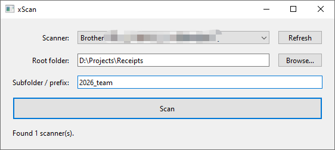

# xScan

A small Windows scanner application built with PySide6 and Windows Image
Acquisition (WIA). It discovers installed WIA scanners and saves scans as JPEGs
using a prefix and timestamp, for example `invoice_20260901_143025.jpg`.



## Why xScan?

The default Windows scanning tool requires multiple clicks for every scan and
does not automatically organize files into folders. xScan reduces the repeated
steps: choose a root folder and subfolder once, then scan directly into the
managed destination with consistent, timestamped filenames. It remembers these
settings for the next launch.

## Run

```powershell
py -m pip install -r requirements.txt
py xscan.py
```

Select a scanner, choose a root folder, enter a subfolder, and click **Scan**.
The subfolder is created below the root and is also used as the filename prefix.
For example, subfolder `invoice` saves to
`<root>\invoice\invoice_20260901_143025.jpg`. Existing files are never
overwritten.

On opening xScan or changing the target folder, **Scans** starts from the number
of JPG files already in that folder. It increases after each successful scan.
**Reset count** starts it again at zero and remembers the reset between launches.
**Open target folder** opens the selected root folder's subfolder in File
Explorer, creating it if needed.

## Settings

xScan remembers the last root folder, subfolder, selected scanner, scan count,
and window position. Settings are stored under the home directory of whichever Windows
user runs the app:

```text
%USERPROFILE%\Tool_Config\xScan\setting.json
```

For example, when the current Windows user is `Tester`, the resolved location is
`C:\Users\Tester\Tool_Config\xScan\setting.json`. The directory and settings file
are created automatically.
